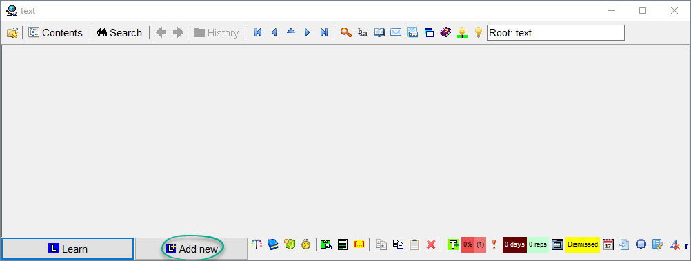
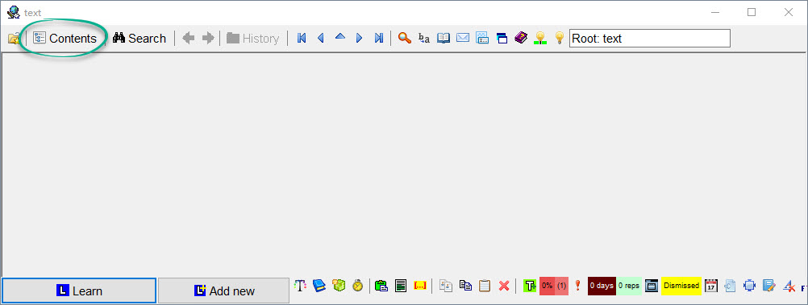

# 创建新集合（collection）
1. `File: New collection`；
2. 在 `File name` 处为集合命名。

## 新建 Item
创建一个 Item 有多种方法：
- 点击按钮 `Add new`以创建一个新的 Item，如下图所示：

- 按下键盘快捷键 `Alt + A` 以创建一个新的 Item；
- 在目录（Contents）中单击鼠标右键依次选择 `New: Item` 即可新建一个 Item。

## 新建 Topic
创建 Topic 的方法同样有多种：
- 按下键盘快捷键 `Alt + N` 即可新建一个 Topic；
- 在目录（Contents）中单击鼠标右键依次选择 `New: Topic` 即可新建一个 Topic。

## 新建 Folder（文件夹）
在目录（Contens）中单击鼠标右键依次选择 `New: Folder` 即可新建一个 Folder。

## Contents （目录）
只需按下键盘快捷键 `Alt + C` 即可打开目录窗口，也可以点击下图中的按钮打开该窗口：

